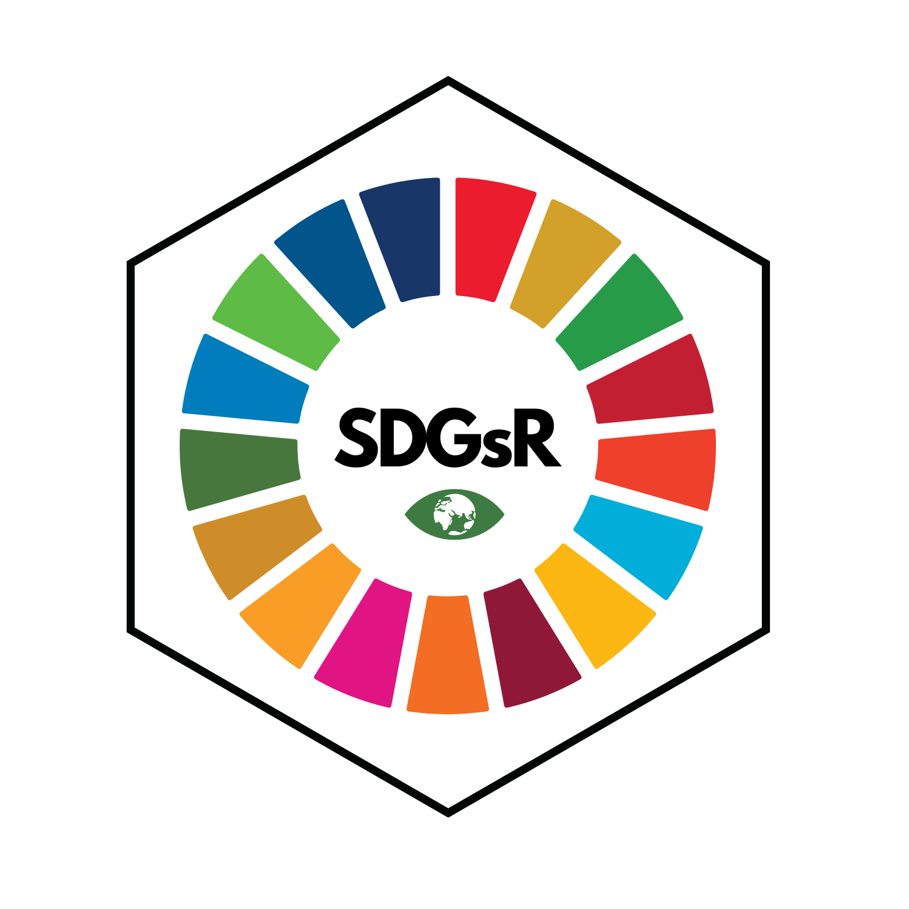

# SDGsR

::: {style="text-align:center;"}
      


:::

An R package for interacting with the UN Sustainable Development Goals API (<https://unstats.un.org/sdgs/UNSDGAPIV5/swagger/>), inspired by <https://rpubs.com/angelamhkim/sdgapi>.

To install this package please use:

``` r
devtools::install_github("DrMattG/SDGsR", dependencies = TRUE)
```

## Example

``` r
library(SDGsR)
require(tidyverse)
Goals<-get_SDGs_goals()
Goals %>% select(goal, code, description ) %>% 
  sample_n(.,3) %>% #randomly select three rows to display
  kableExtra::kable()
```

| goal | code | description                                                                                                                                                                                                                                        |
|:-------|:-------|:------------------------------------------------------|
| 9    | 9.3  | Increase the access of small-scale industrial and other enterprises, in particular in developing countries, to financial services, including affordable credit, and their integration into value chains and markets                                |
| 5    | 5.4  | Recognize and value unpaid care and domestic work through the provision of public services, infrastructure and social protection policies and the promotion of shared responsibility within the household and the family as nationally appropriate |
| 6    | 6.2  | By 2030, achieve access to adequate and equitable sanitation and hygiene for all and end open defecation, paying special attention to the needs of women and girls and those in vulnerable situations                                              |

## Citation

``` r
citation("SDGsR")
```

```         
## 
## To cite package 'SDGsR' in publications use:
## 
##   Matt Grainger (2021). SDGsR: Interface with the UN SDGs API to get
##   data about the Sustainable Development Goals. R package version
##   0.0.0.9000. https://drmattg.github.io/SDGsR/
## 
## A BibTeX entry for LaTeX users is
## 
##   @Manual{,
##     title = {SDGsR: Interface with the UN SDGs API to get data about the Sustainable Development Goals},
##     author = {Matt Grainger},
##     year = {2021},
##     note = {R package version 0.0.0.9000},
##     url = {https://drmattg.github.io/SDGsR/},
##   }
```
