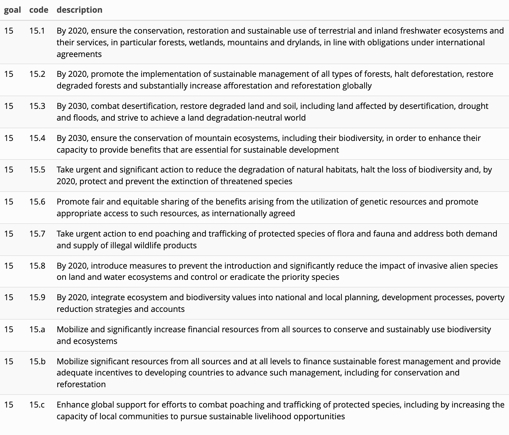
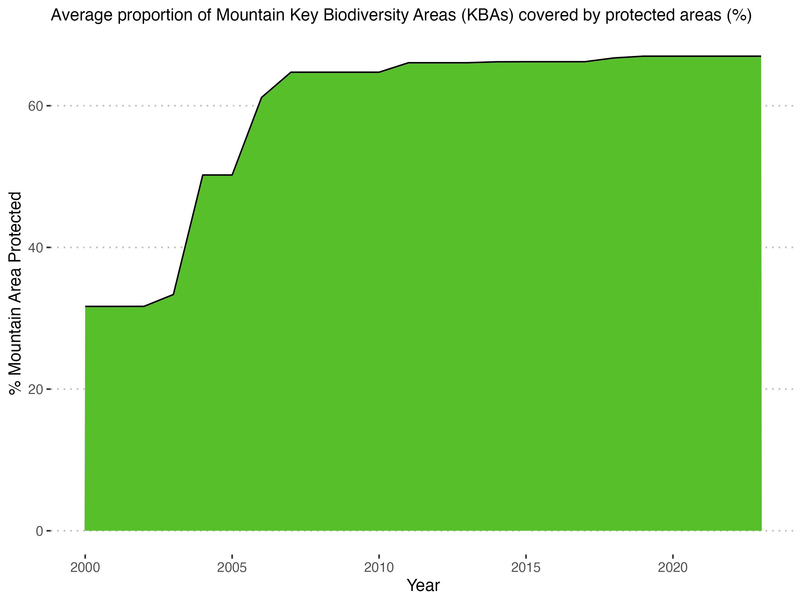

# Summary

The UN World Data Forum highlighted that the power of data can only be harnessed, and its true value realized, by bringing it together, through statistical analysis, and by connecting it to other data sets to inform solutions for challenges facing humanity [@IISD 2023] .The R  programming language is  the most utilized programming language for statistical analysis [@Rice University 2023]. Because of R's open-source nature, its robust community of users, and its support for reproducibility, it has quickly become a key tool in the Open Science movement. R facilitates researchers’ and data scientists’ abilities to disseminate state-of-the-art statistical methods, share their own analysis work, and reproduce the work of others [@Hewlig 2024]. These characteristics of R make it an optimal tool for statistical analysis of the SDG’s, however, no current tool exists to leverage the United Nations Statistics Division SDG API and seamlessly import SDG data into R. The SDGsR package addresses this gap, providing a valuable resource for integrating SDG data with R for more comprehensive analysis and insights.

# Statement of need

The Sustainable Development Goals (SDGs) are a set of measurable, specific, and time-sensitive goals built with a mission for national development. Available, accurate, and quality data and statistics are crucial in making significant progress toward achieving these goals [@Nilashi 2023].  Furthermore, analyzing SDG data is necessary for assessing progress, informing policy-making, allocating resources, and identifying existing gaps [@RELX, nd]. 

R is an open-source software and a powerful programming language commonly used for data analysis, modeling, and visualization. It allows its users to utilize data to perform analysis, produce visualizations, and promote data reproducibility and transparency in their work [@Lai et. al, 2023]. R packages are fundamental units of reproducible R code that often include R functions, documentation, and sample data. Organizing code in a package not only assists in running the user’s code more efficiently, but also provides a space to share their code with others where they can easily download and run code [@Wickham & Bryan, 2023]. Utilizing R and R packages to analyze SDG data is becoming increasingly more common in the data analysis environment. Other existing R packages include SDGdetector and text2sdg. 

Application programming interfaces (APIs) are useful for data integration, enrichment, access, and sharing. APIs functionality for exchanging information have a significant impact on growth, efficiency, and innovation in a variety of fields such as healthcare, automotive, and banking. The potential for APIs has been recognized through the 21st Century Cures Act where it is required that health information technology developers make standards-based APIs available [@Gordon & Rudin, 2022]). 

The United Nations Statistics Division has an API that allows users to explore official SDG data reported by custodian agencies (https://unstats.un.org/sdgs/UNSDGAPIV5/swagger/). However, manually downloading the most updated data from the SDG API comes with the additional steps of changing the data format, reading the file into R, etc. SDGsR addresses this challenge by leveraging the SDG API in an R package with functions to access updated SDG data efficiently in the R environment. Such data and information are pulled directly from SDG API v5. 


# Functionality 

SDGsR is an R package developed to interact with and leverage the UN Sustainable Development Goals API (UNSDGAPIV5) by providing the ability to:
- extract SDG indicator data for specific countries
- extract information on each SDG goal and its targets
- explore the SDG Goals, Targets, and indicators as a dataframe
- retrieve country codes
- access the SDG color palette

The package is inspired by an article discussing extracting API data in R (Kim, 2019). SDGsR is available on GitHub at https://github.com/DrMattG/SDGsR. 

# Usage
- SDG Goals and Indicators
- Country Code
- Color palette 

To begin using this package, use the following installation code:

```
devtools::install_github("DrMattG/SDGsR", dependencies = TRUE)
```

```
# load package
library(SDGsR)
```

To get the text of the Goals we can use the SDGsR::get_SDGs_goals() function. This gathers together all the Goals in to a single dataframe.

```
Goals <- get_SDGs_goals() # get goals, targets, and indicator descriptions as a dataframe

Goals %>%
  select(goal, code, description) %>%
  filter(goal == 15) %>%
  kableExtra::kable() %>%
  kableExtra::kable_styling(bootstrap_options = "striped", full_width = FALSE)
```


The most useful function is the `SDGsR::get_indicator()` function that allows the user to query the data for a specific indicator in a specific country. First we need to make sure we know which is the correct code for the country and for the indicator as the API uses these to distinguish which data to export. There is an country list in the package that you can use to find the name of the country you are looking for.

```
head(get_country_list())
#> [1] "Afghanistan"    "Åland Islands"  "Albania"        "Algeria"       
#> [5] "American Samoa" "Andorra"
```

To find a specific indicator we need to know the right code to use. We can get a list of all the indicators by using SDGsR::get_indicator_list. I am interested in the indicators that are in Goal 15 Life on Land.

```
ind_lst <- get_indicator_list()

ind_lst %>% 
  filter(goal=="15") %>% 
  select(target, code, description) %>% 
  kableExtra::kable()
```


Let’s look at the indicator for Target 15.4, “15.4.1: Coverage by protected areas of important sites for mountain biodiversity” and we will specify Norway as our country of interest. We know that Norway is named Norway on our country list (which is obvious but some countries are named in different ways to how we might commonly expect, e.g. Vietnam is specified as “Viet Nam”, Venezuela is specified as “Venezuela (Bolivarian Republic of)”).

```
Norway_code <- lookup_country(code="M49", country = "Norway")
Norway_code
#> [1] 578
```

```
Norway <-g et_indicator(Country = Norway_code, indicator = "15.4.1")
```

We can then make a plot of this data using the SDGsR::SDGs_colours() function.

```
Norway %>% 
  select(timePeriodStart, value, seriesDescription) %>% 
  ggplot(aes(timePeriodStart, as.numeric(value))) +
  geom_area(fill = SDGs_cols("Goal15"), color = "black") +
  labs(x = "Year", y = "% Mountain Area Protected") +
  ggtitle(label = paste0(Norway$seriesDescription[1])) +
  ggpubr::theme_pubclean() +
  theme(plot.title = element_text(size = 12))
```




# Mathematics

Single dollars ($) are required for inline mathematics e.g. $f(x) = e^{\pi/x}$

Double dollars make self-standing equations:

$$\Theta(x) = \left\{\begin{array}{l}
0\textrm{ if } x < 0\cr
1\textrm{ else}
\end{array}\right.$$

You can also use plain \LaTeX for equations
\begin{equation}\label{eq:fourier}
\hat f(\omega) = \int_{-\infty}^{\infty} f(x) e^{i\omega x} dx
\end{equation}
and refer to \autoref{eq:fourier} from text.

# Citations

Citations to entries in paper.bib should be in
[rMarkdown](http://rmarkdown.rstudio.com/authoring_bibliographies_and_citations.html)
format.

If you want to cite a software repository URL (e.g. something on GitHub without a preferred
citation) then you can do it with the example BibTeX entry below for @fidgit.

For a quick reference, the following citation commands can be used:
- `@author:2001`  ->  "Author et al. (2001)"
- `[@author:2001]` -> "(Author et al., 2001)"
- `[@author1:2001; @author2:2001]` -> "(Author1 et al., 2001; Author2 et al., 2002)"
- 


`@IISD:2023` -> "IISD (2023)"
International Institute for Sustainable Development. (2023). UN World Data Forum Bulletin: Summary of the UN Fourth World Data Forum, 24-27 April 2023. https://enb.iisd.org/un-world-data-forum-2023

@RICE Unoversity 2023
Rice University Department of Computer Science. (2023, January 20). 12 Best Programming Languages for Data Science and Analytics. Rice Engineering and Computing. https://cs.rice.edu 

@Hewlig 2024
Helwig, N. (n.d.). Investigating the R in (R)evolution of Open Science. Department of Psychology and School of Statistics, [Institution Name]. Retrieved from [insert URL]

@Nilashi 2023
Nilashi, M., Boon, O. K., Tan, G., Lin, B., & Abumalloh, R. (2023). Critical data challenges in measuring the performance of sustainable development goals: Solutions and the role of ;/big-data analytics. Harvard Data Science Review, 5(3). https://doi.org/10.1162/99608f92.545db2cf. 

@RELX
RELX. (n.d.). Data & Analytics. RELX SDG Resource Centre. https://sdgresources.relx.com/data-analytics 

@Lai et. al, 2023
Lai, J., Cui, D., Zhu, W., & Mao, L. (2023). The use of R and R packages in biodiversity conservation research. Diversity, 15(12). https://doi.org/10.3390/d15121202 

@Wickham & Bryan, 2023
Wickham, H. & Bryan, J. (2023). R Packages: Organize, Test, Document, and Share Your Code [eBook edition]. O’Reilly Media. https://r-pkgs.org/ 

@Gordon & Rudin, 2022
Gordon, W. J. & Rudin, R. S. (2022). Why APIs? Anticipated value, barriers, and opportunities for standards-based application programming interfaces in healthcare: Perspectives of US thought leaders. JAMIA Open, 5(2). https://doi.org/10.1093/jamiaopen/ooac023


# Figures

Figures can be included like this:

and referenced from text using \autoref{fig:example}.

Figure sizes can be customized by adding an optional second parameter:
{ width=20% }

# Acknowledgements

We acknowledge contributions from Brigitta Sipocz, Syrtis Major, and Semyeong
Oh, and support from Kathryn Johnston during the genesis of this project.

# References
