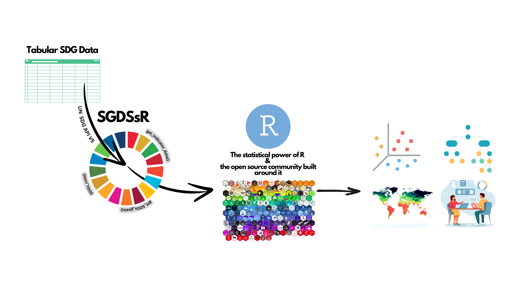
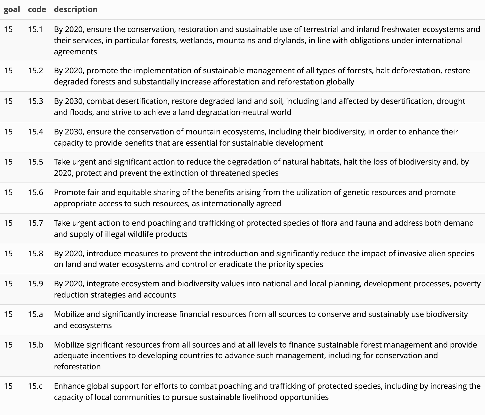
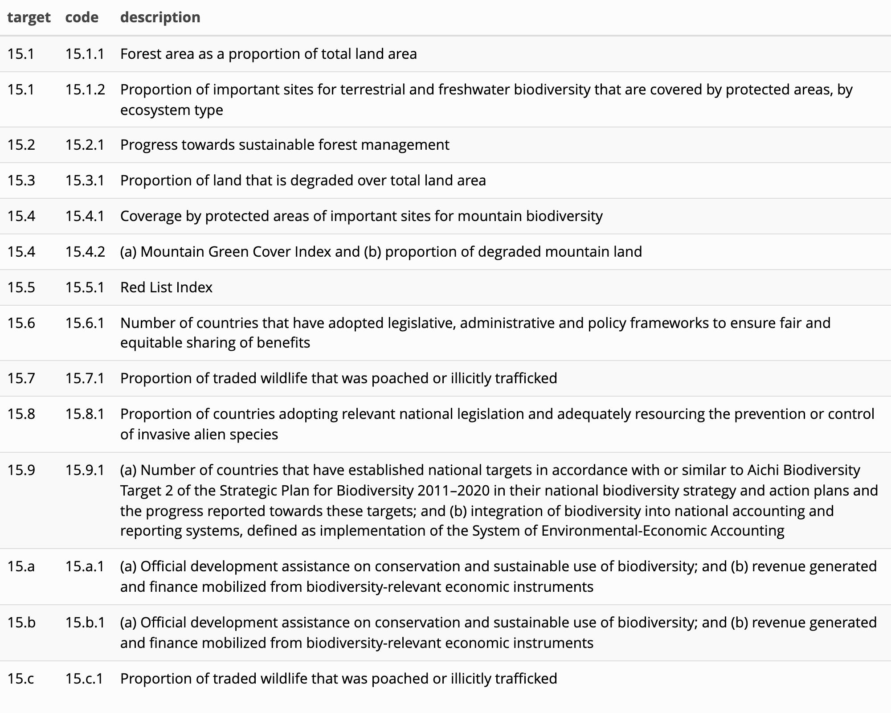
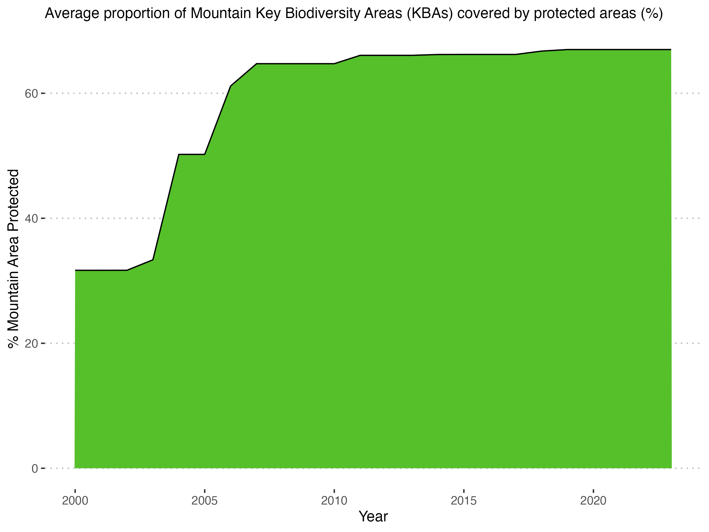

# Summary

The UN World Data Forum highlighted that the power of data can only be harnessed, and its true value realized, by bringing it together, through statistical analysis, and by connecting it to other data sets to inform solutions for challenges facing humanity [@iisd_2023] .The R  programming language is  the most utilized programming language for statistical analysis [@rice_programming_2023]. Because of R's open-source nature, its robust community of users, and its support for reproducibility, it has quickly become a key tool in the Open Science movement. R facilitates researchers’ and data scientists’ abilities to disseminate state-of-the-art statistical methods, share their own analysis work, and reproduce the work of others [@helwig_r_2024]. These characteristics of R make it an optimal tool for statistical analysis of the SDG’s, however, no current tool exists to leverage the United Nations Statistics Division SDG API and seamlessly import SDG data into R. The SDGsR package addresses this gap, providing a valuable resource for integrating SDG data with R for more comprehensive analysis and insights.

# Statement of need

The Sustainable Development Goals (SDGs) are a set of measurable, specific, and time-sensitive goals built with a mission for national development. Available, accurate, and quality data and statistics are crucial in making significant progress toward achieving these goals [@nilashi_critical_2023].  Furthermore, analyzing SDG data is necessary for assessing progress, informing policy-making, allocating resources, and identifying existing gaps [@relx_data_analytics]. 

R is an open-source software and a powerful programming language commonly used for data analysis, modeling, and visualization. It allows its users to utilize data to perform analysis, produce visualizations, and promote data reproducibility and transparency in their work [@lai_use_2023]. R packages are fundamental units of reproducible R code that often include R functions, documentation, and sample data. Organizing code in a package not only assists in running the user’s code more efficiently, but also provides a space to share their code with others where they can easily download and run code [@wickham_r_packages_2023]. Utilizing R and R packages to analyze SDG data is becoming increasingly more common in the data analysis environment. Other existing R packages include SDGdetector and text2sdg. 

Application programming interfaces (APIs) are useful for data integration, enrichment, access, and sharing. APIs functionality for exchanging information have a significant impact on growth, efficiency, and innovation in a variety of fields such as healthcare, automotive, and banking. The potential for APIs has been recognized through the 21st Century Cures Act where it is required that health information technology developers make standards-based APIs available [@gordon_why_2022]. 

The United Nations Statistics Division has an API that allows users to explore official SDG data reported by custodian agencies (https://unstats.un.org/sdgs/UNSDGAPIV5/swagger/). However, manually downloading the most updated data from the SDG API comes with the additional steps of changing the data format, reading the file into R, etc. SDGsR addresses this challenge by leveraging the SDG API in an R package with functions to access updated SDG data efficiently in the R environment. Such data and information are pulled directly from SDG API v5. 




# Functionality 

SDGsR is an R package developed to interact with and leverage the UN Sustainable Development Goals API (UNSDGAPIV5) by providing the ability to:
- extract textual information on each SDG, including targets and indicators
- identify country codes 
- utilize the SDG color palette with ggplot
- pull most recent/historical indicator data for specific countries

The package is inspired by an article discussing extracting API data in R (Kim, 2019). SDGsR is available on GitHub at https://github.com/DrMattG/SDGsR. 

# Usage

To begin using this package, a user can use the following installation code:

```
devtools::install_github("DrMattG/SDGsR", dependencies = TRUE)
```

```
# load package
library(SDGsR)
```

To get the text of the Goals, use the SDGsR::get_SDGs_goals() function. This gathers together all the Goals in to a single dataframe.

```
Goals <- get_SDGs_goals() # get goals, targets, and indicator descriptions as a dataframe

Goals %>%
  select(goal, code, description) %>%
  filter(goal == 15) %>%
  kableExtra::kable() %>%
  kableExtra::kable_styling(bootstrap_options = "striped", full_width = FALSE)
```


The most useful function is the `SDGsR::get_indicator()` function that allows the user to query the data for a specific indicator in a specific country. First, it is necessary to know the correct code for the country and for the indicator as the API uses these to distinguish which data to export. There is an country list in the package that can be utilized to find country names.

```
head(get_country_list())
#> [1] "Afghanistan"    "Åland Islands"  "Albania"        "Algeria"       
#> [5] "American Samoa" "Andorra"
```

To find a specific indicator, a user must know the right code to use. Users can retrieve a list of all the indicators by using SDGsR::get_indicator_list. This example demonstrated indicators for Goal 15 Life on Land.

```
ind_lst <- get_indicator_list()

ind_lst %>% 
  filter(goal=="15") %>% 
  select(target, code, description) %>% 
  kableExtra::kable()
```



This example looks at the indicator for Target 15.4, “15.4.1: Coverage by protected areas of important sites for mountain biodiversity” and specifies Norway as our country of interest. A user can confirm that Norway is named Norway on our country list, however, there are some countries  named in different ways than what might be commonly expected, e.g. Vietnam is specified as “Viet Nam”, Venezuela is specified as “Venezuela (Bolivarian Republic of)”).

```
Norway_code <- lookup_country(code="M49", country = "Norway")
Norway_code
#> [1] 578
```

```
Norway <-g et_indicator(Country = Norway_code, indicator = "15.4.1")
```

A user can utilize the SDGsR::SDGs_colours() function in conjunction with ggplot to match plot colors with the corresponding SDG color.

```
Norway %>% 
  select(timePeriodStart, value, seriesDescription) %>% 
  ggplot(aes(timePeriodStart, as.numeric(value))) +
  geom_area(fill = SDGs_cols("Goal15"), color = "black") +
  labs(x = "Year", y = "% Mountain Area Protected") +
  ggtitle(label = paste0(Norway$seriesDescription[1])) +
  ggpubr::theme_pubclean() +
  theme(plot.title = element_text(size = 12))
```




# Acknowledgements

We acknowledge contributions from....

# References
